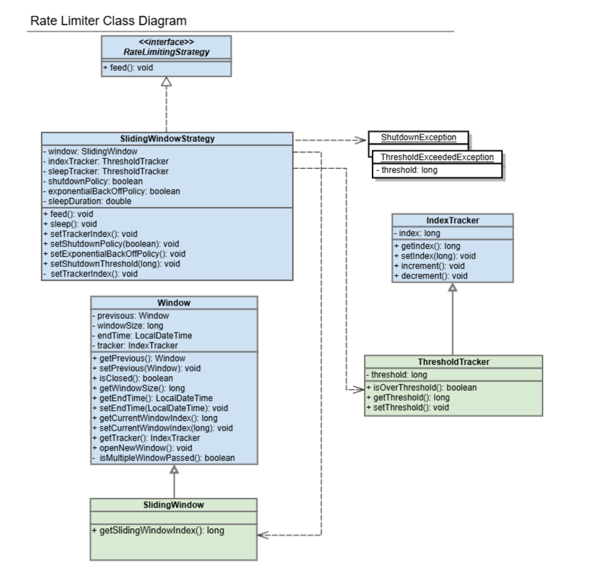

### 개요
이 프로젝트는 Rate Limiter(요청량 제한기) 구현입니다.

배치, stream과 같이 지속적으로 외부 시스템과 상호작용하는 처리 방식에서는 외부 시스템의 응답시간이 느려지는 latency가 발생할 수 있습니다.  
Rate Limiter 모듈의 경우, 수행 중 발생한 latency 요소(timeout, response time, response size 등)을 기반으로 이에 대응할 수 있도록 했습니다.  

SlidingWindowStrategy 구현체를 사용하여 window 내의 index(latency 요소)가 threshold를 넘어서면 Thread.sleep()을 호출하여 외부 시스템 상호작용 사이에 대기 시간을 확보할 수 있습니다.  
또한 대기 횟수가 지속적으로 증가한다면 exponentialBackOff 플래그를 통해 대기 시간을 점진적으로 증가시킬 수 있으며, shutdownPolicy를 통해 대기 횟수가 threshold 이상으로 누적되는 경우 예외를 발생시켜 대응할 수 있습니다.

아래는 해당 모듈의 클래스 다이어그램이며 이후 개발에 참고가 되었으면 좋겠습니다.

